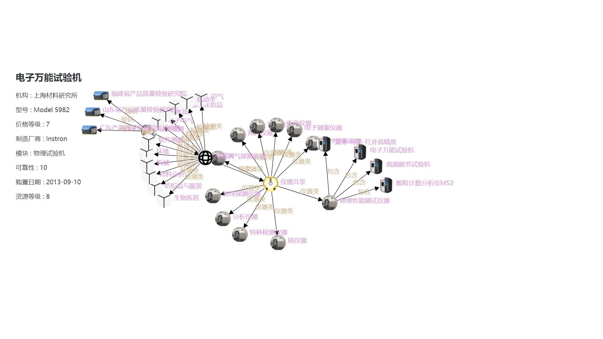

毕业设计的使用说明，使用 office 插件转换的 md 文件，然后使用正则表达式对格式进行了略微的调整，感觉非常好用，尤其图片自动导出很省事。

附相关插件的地址

[Writage](https://www.writage.com/)

使用方法上网搜索一下就可以找到。

---

# 登录

当进入页面后，将自动检测用户是否已经登录，如未登录则显示登录/注册选项卡，要求用户进行登录或注册操作。用户如完成操作或希望使用其他用户登录，则可以进行登出操作。

图 1使用未注册账号登录

系统会弹出相应的提示信息显示无法登录：

图 2无法登录的提示

点击注册的话会有相应的提示：

图 3注册成功的提示

注册成功之后可以使用对应的账号登录：

图 4登陆成功的提示

登录系统后可以登出系统：

图 5通过功能选项登出系统

图 6通过退出的图标退出系统

# 整体界面说明

登录成功后可以通过顶栏的选择功能-\>知识图谱编辑进入到知识图谱编辑的功能当中：

图 7进入知识图谱编辑功能

图 8 是本工具的实现的界面样式，其中，顶栏是选择功能的对应导航栏，左侧可以实现选择文件、模板选择、子图存取、图谱全屏的相应功能，右侧图谱展示和交互区域，图谱中的实体和关系展示的样式将与相关联的图元模板样式相同。

图谱上方会展示当前选择的文件和关系名称，顶部右侧有查询子图的搜索框。

图 8整体界面

# 用户文件系统说明

## 3.1 文件系统展示方式说明

文件以层叠的方式展示，并可以根据用户的需要折叠展开某一文件夹下的子文件系统。图 9 显示文件系统的展示效果。

图 9文件目录的展示效果

使用搜索框可以对文件名进行模糊查询，方便快捷地找到需要的文件：

图 10模糊查询

## 3.2 文件系统编辑功能说明

文件系统的编辑功能包括在任意层级下创建新文件或文件夹，删除文件或文件夹以及对文件或文件夹重命名。

新建文件或者文件夹通过点击对应父文件夹后面的添加按钮，然后填写对应的信息，点击确认后完成新文件或者新文件夹的创建，其中新文件或者新文件夹是通过切换按钮来实现的。

图 11添加新文件的表单

图 12切换为添加新文件夹

删除文件夹或文件通过点击对应文件或者文件夹之后的删除按钮来实现。点击后会弹出操作的提醒弹窗，确认后实现删除。

图 13删除的确认信息

重命名文件或文件夹通过点击对应文件或者文件夹之后的重命名按钮来实现，其中重命名时对应项目的类型无法修改。

# 图元模板系统说明

## 4.1 图元模板目录说明

为了更好的管理对应的图元，项目提供了包含图元的模板，图元模板和文件系统类似，

图 14图元模板系统

## 4.2 图元编辑说明

点击对应的图元模板后，就可以对图元进行编辑：

图 15图元编辑模板

首先，在节点模板或者关系模板下点击添加模板，就可以添加一个对应的图元模板。

图 16新建模板

点击对应模板的删除按钮，可以删除对应的图元。

图 17删除成功的提示

点击对应图元的设置按钮，可以对图元的属性进行设置，可以新增属性，或者对属性进行重命名，也可以上传图片来设置图元在图谱中的展示样式：

图 18图元属性设置

# 知识图谱编辑说明

## 5.1 图谱界面说明

知识图谱在页面的右下方展示，其中节点用紫色的文字标识，关系用黄色的文字表示，当鼠标悬停在节点或者关系的上方时，会在左侧展示对应的属性值：

图 19图谱界面

图 20悬停展示属性

## 5.2 图谱编辑说明

除了悬停查看图谱节点属性，图谱也支持增、删、改等编辑操作。

新增节点点击对应节点的添加按钮，然后输入节点的名称即可：

图 21对应图元的添加按钮

图 22填写新建节点的名称

_新建关系节点需要选中对应的关系，然后按住鼠标右键从源节点拖拽至目标节点放开_，然后填写新建关系的名称即可：

图 23填写新建关系的名称

节点和关系的属性修改和删除，都是通过鼠标左键单击对应的节点和关系，然后会出现属性的表单，通过修改表单内容或者点击删除按钮可以实现修改属性或者删除图元：

图 24单击后可以修改属性或者删除节点

# 图谱抽取

可以在这一区域对原始图谱进行抽取，需要输入实体的名称和需要抽取的跳数（层数），然后点击查询子图。

图 25子图查询

子图查询完成之后，点击右侧的子图存取按钮，

图 26子图存取

依次点击”添加子图”按钮-\>在输入框中输入名称即可完成子图保存的过程。

图 27添加子图

图 28点击后在输入框中输入名称

子图的读取点击对应的名称按钮即可，子图的删除点击按钮后的删除符号即可。

图 29加载和删除子图

