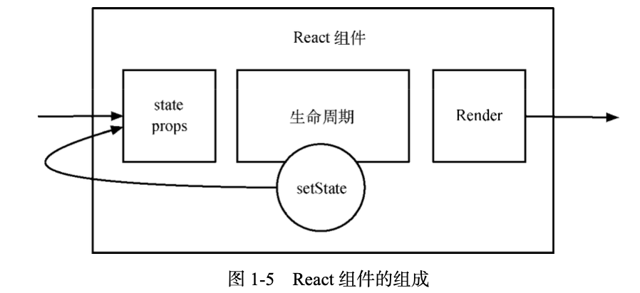
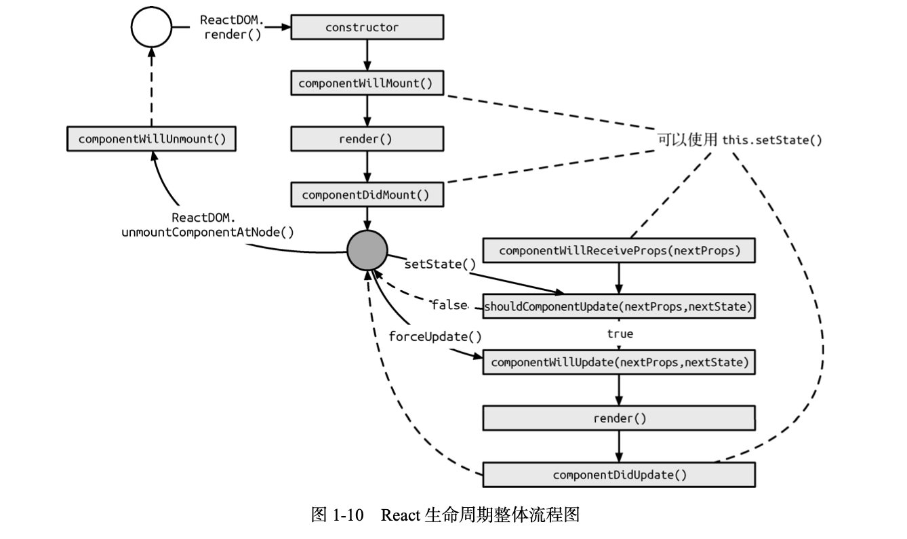
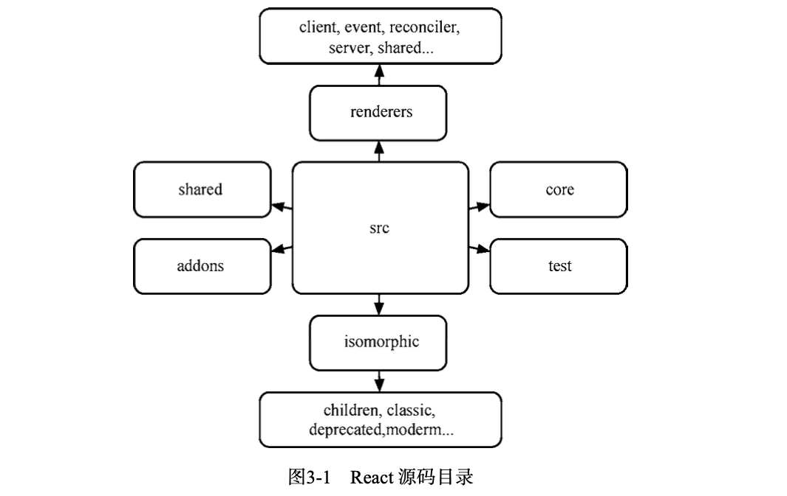

书籍名称：

深入 React 技术栈

---

## 目录

- [序言](#序言)
- [初入 React 世界](#初入-react-世界)
- [漫谈 React](#漫谈-react)
- [解读 React 源码](#解读-react-源码)

---

## 序言

React 平衡了函数式编程的约束与工程师的实用主义。

- React 将 DOM 当成纯函数。
- React 强调不可变性和单向数据流。

---

## 初入 React 世界

React 并不是完整的 MVC/MVVM 框架，提供清晰、简洁的 View（视图）层解决方案。

### 1.2 JSX 语法

在实际开发中，JSX 在产品打包阶段都已经编译成纯 JavaScript......现在已全部采用 Babel 的 JSX 编译器实现......而 Babel 作为专门的 JavaScript 语法编译工具，提供了更为强大的功能，达到了“一处配置、统一运行”的目的。

#### 1.2.2 JSX 基本语法

- JSX 在定义标签时，只允许被一个标签包裹，原因是需要转译成对应的 React.createElement 调用方法，如果没有包裹，就无法转译成方法调用。
- 标签需要闭合，HTML 中规定的自闭合标签在 JSX 中遵循同样规则，自定义标签可以根据是否有子组件或文本来决定闭合方式。

JSX 中小写首字母对应 DOM 元素，而大写字母对应组件元素。

JSX 还是 JavaScript，依然可以使用简单的方法使用注释，但是在组件的子元素的位置使用注释要用大括号包起来：

```jsx
const App = (
	<Nav>
  	{/*节点注释*/}
    <Person
      /*多行
      	注释*/
      name={window.isLoggedIn ? window.name : ''}
     />
  </Nav>
)
```

DOCTYPE 头一般会在使用 React 作为服务端渲染时用到，在 HTML 中，DOCTYPE 是没有闭合的，无法在 JSX 渲染它。

常见的做法是构造一个保存 HTML 的变量，将 DOCTYPE 与整个 HTML 标签渲染后的结果串联起来。

JSX 属性有一些特殊的规则：

- DOM 元素属性中 class 属性改为 className
- DOM 元素属性中 for 属性改为 htmlFor
- 省略 Boolean 属性值会导致 JSX 认为设置为 true
- 可以使用 ES6 rest 特性来传递参数：

```jsx
const data = {name:'foo', value:'bar'}
const component = <Component {...data} />
```

- 在 JSX 中往 DOM 元素传入自定义属性，React 不会渲染，要使用 HTML 自定义属性，和 HTML 标准一致，要使用 data- 前缀

### 1.3 React 组件

#### 1.3.2 React 组件的构成

React 组件即为组件元素。组件元素被描述为纯粹的 JSON 对象，意味着可以使用方法或者类来构建。

React 组件基本上由三个部分组成——属性、状态、以及生命周期方法。



React 组件构建有三种不同的方法：React.createClass、ES6 classes 和无状态函数。

### 1.4 React 数据流

在 React 中，数据是自顶向下单向流动的，从父组件向子组件流动。

如果顶层组件初始化 props，那么 React 会向下遍历整棵组件树，重新尝试渲染所有相关的组件。而 state 只关心每个组件内部的状态，这些状态只能在组件内改变。

#### 1.4.1 state

当组件内部使用内置的 setState 方法时，最大的表现行为就是该组件会尝试重新渲染。

setState 是一个异步方法，一个生命周期内所有的 setState 方法会合并操作。

#### 1.4.2 props

React 的单向数据流，主要的流动管道就是 props，props 本身是**不可变的**，当我们试图改变 props 的原始值时，React 会报出类型错误的警告，组件的 props 一定来自于默认属性或者通过父组件传递而来。

在 React 中有一个重要且内置的 prop —— children，它代表组件的子组件集合。children 可以根据传入的子组件数量来决定是否是数组类型。

React.Children 是 React 官方提供的一系列操作 children 的方法。它提供诸如 map 、forEach 、count 等实用函数。

[React.Children 官方文档](https://zh-hans.reactjs.org/docs/react-api.html#reactchildren)

可以利用 React.Children 来实现**动态子组件**：

```react
class NotesList extends React.Component {
  render(){
    return (
    	<ol>
      	{
          React.Children.map(this.props.children, (child) => {
            return <li>{child}</li>;
          })
        }
      </ol>
    );
  }
}

ReactDOM.render(
	<NotesList>
  	<span>hello</span>
    <span>world</span>
  </NotesList>,
  document.getElementById('root');
);
```

### 1.5 React 生命周期

#### 1.5.1 挂载或卸载过程

```react
import React, { Component, PropTypes } from 'react';

class App extends Component {
  static propTypes = {
    // ...
  };

	static defaultProps = {
    // ...
  };

	constructor(props) {
    super(props);
    
    this.state = {
      // ...
    };
  }

	componentWillMount() {
    // ...
  }

	componentDidMount() {
    // ...
  }

	componentWillUnmount() {
    // ...
  }

	render() {
    return <div>This is a demo.</div>
  }
}
```

#### 1.5.2 数据更新过程

```react
import React, { Component, PropType } from 'react';

class App extends Component {
  componentWillReceiveProps(nextProps) {
    // this.setState({})
  }
  
  shouldComponentUpdate(nextProps, nextState) {
    // return true;
  }
  
  componentWillUpdate(nextProps, nextState) {
    // ...
  }
  
  componentDidUpdate(prevProps, prevState) {
    // ...
  }
  
  render() {
    return <div>This is a demo.</div>
  }
}
```



### 1.6 React 与 DOM

DOM 真正被添加到 HTML 中的生命周期方法是 componentDidMount 和 componentDidUpdate 方法。在这两个方法中，我们可以获取真正的 DOM 元素。React 可以通过 ReactDOM 提供的 findDOMNode 方法来获得 DOM。

```react
import React, { Component } from 'react';
import ReactDOM from 'react-dom';

class App extends Component {
  componentDidMount() {
    // render 中返回什么，这儿就返回什么
    const dom = ReactDOM.findDOMNode(this);
  }
  
  render(){
    //....
  }
}
```

#### 1.6.3 refs

refs 是 React 组件中一个非常特殊的 prop，它可以和绑定在子组件上的 ref 联动，ref有两种常见的用法：

- 绑定一个函数，将子组件在其中绑定到一个引用上，暴露出去。
- 绑定一个字符串，从而可以在 componentDidMount 和 componentDidUpdate 中通过 this.refs 引用到。

```react
import React, { Component } from 'react';

class App extends Component {
  constructor(props){
    super(props);
    this.handleClick = this.handleClick.bind(this);
  }
  
  handleClick(){
    if(this.myTextInput !== null){
      this.myTextInput.focus();
    }
  }
  
  render() {
    return (
    	<div>
        <input type='text' ref={(ref) => this.myTextInput = ref} />
        <input
          type='button'
          value='Focus the text Input'
          onClick={this.handleClick}
         />
      </div>
    )
  }
}
```

```react
import React, { Component } from 'react';
import ReactDOM from 'react-dom';

class App extends Component {
  componentDidMount() {
    const myComp = this.refs.myComp;
    const dom = findDOMNode(myComp);
  }
  
  render() {
    return (
     <div>
      	<Comp ref="myComp" />
      </div>
    );
  }
}
```

将 refs 放到原生的 DOM 组件 input 中，可以通过 refs 得到 DOM 节点；如果将 refs 放到 React 组件，获得的就是 TextInput 的实例。

然后可以使用 findDOMNode 获得组件 DOM 。

为了防止内存泄漏，当卸载一个组件的时候，组件里面所有的 refs 就会变成 null。

#### 1.6.4 React 之外的 DOM 操作

调用 HTML5 Audio/Video 的 play 方法和 input 的 focus 方法时，React 就无能为力了，就只能使用相应的 DOM 方法来实现。

---

## 漫谈 React

### 2.1 事件系统

Virtual DOM 在内存中是以对象的形式存在的。React 基于 Virtual DOM 实现了一个合成事件层，我们所定义的事件处理器会接收到一个 SyntheticEvent 对象的实例。它与原生浏览器事件一样拥有同样的接口，同样支持事件的冒泡机制，也可以使用 stopPropagation( ) 和 preventDefault( ) 来中断它。

在 React 底层，主要对合成事件做了两件事：事件委派和自动绑定。

**事件委派**：React 不会把事件处理函数绑定到真实的节点上，而是把所有事件绑定到结构的最外层，使用一个统一的事件监听器，这个事件监听器上维持了一个映射来保存所有组件内部的事件监听和处理函数。当组件挂载或卸载时，只是在这个统一的事件监听器上插入或删除一些对象。

**自动绑定**：this 自动绑定到组件实例上，使用 ES6 class 或纯函数需要手动实现：bind、构造器内 bind、箭头函数。

合成事件的绑定不需要关心移除的问题，React 会处理事件的移除。

#### 2.1.4 合成事件和原生事件混用

阻止 React 事件冒泡的行为只能用于 React 合成事件系统，且无法阻止原生事件的冒泡。在原生事件中的阻止冒泡行为，却可以阻止 React 合成事件的传播。

React 的合成事件没有实现事件捕获。

### 2.2 表单

#### 2.2.2 受控组件

React 受控组件更新 state 的流程：

1. 在初始 state 中设置表单的默认值
2. 当表单值发生变化时，调用 onChange 事件处理器
3. 事件处理器通过合成事件对象 e 拿到改变后的状态，并更新应用的 state
4. setState 触发视图的重新渲染，完成表单组件值的更新

#### 2.2.3 非受控组件

1. 使用 defaultValue 或者 defaultCheck prop 来表示组件的默认状态
2. 通过 ref 来取值

### 2.3 样式处理

设置样式时：

- 自定义组件建议支持 className prop，支持添加自定义属性
- 设置行内样式要使用对象
- React 会自动为某些样式添加像素单位 px

### 2.4 组件间通信

子组件与父组件的通信利用子组件接收回调函数，然后父组件传入回调函数中 setState 来实现。

组件间通信一般采用 context，但是 context 会导致状态管理的混乱，同时也使得组件之间耦合程度变高，所以建议最好不用。

#### 2.5.2 高阶组件

实现高阶组件的方法有如下两种：

- 属性代理
- 反向继承

属性代理：

```react
import React, { Component } from 'React';

class MyContainer = (WrappedComponent) => {
  class extends Component {
    render() {
      return <WrappedComponent {...this.props} />
    }
  }
}
```


反向继承：

```react
const MyContainer = (WrappedComponent){
  class extends WrappedComponent {
    render() {
      return super.render();
    }
  }
}
```

#### 2.5.3 组合式组件开发实践


---

## 解读 React 源码

### 3.1 初探 React 源码



- addons:包含一系列的工具方法插件，如 PureRenderMixin、CSSTransitionGroup、Fragment、 LinkedStateMixin 等。
-  isomorphic:包含一系列同构方法。
- shared:包含一些公用或常用方法，如 Transaction、CallbackQueue 等。
- test:包含一些测试方法等。
- core/tests:包含一些边界错误的测试用例。
- renderers:是 React 代码的核心部分，它包含了大部分功能实现，此处对其进行单独分析。

