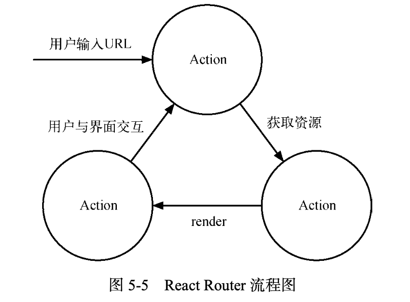

书籍名称：

深入 React 技术栈

---

## 目录

- [序言](#序言)
- [初入 React 世界](#初入-react-世界)
- [漫谈 React](#漫谈-react)
- [解读 React 源码](#解读-react-源码)
- [认识 Flux 架构模式](#认识-flux-架构模式)
- [深入 Redux 应用架构](#深入-redux-应用架构)
- [总结](#总结)

---

## 序言

React 平衡了函数式编程的约束与工程师的实用主义。

- React 将 DOM 当成纯函数。
- React 强调不可变性和单向数据流。

---

## 初入 React 世界

React 并不是完整的 MVC/MVVM 框架，提供清晰、简洁的 View（视图）层解决方案。

### 1.2 JSX 语法

在实际开发中，JSX 在产品打包阶段都已经编译成纯 JavaScript......现在已全部采用 Babel 的 JSX 编译器实现......而 Babel 作为专门的 JavaScript 语法编译工具，提供了更为强大的功能，达到了“一处配置、统一运行”的目的。

#### 1.2.2 JSX 基本语法

- JSX 在定义标签时，只允许被一个标签包裹，原因是需要转译成对应的 React.createElement 调用方法，如果没有包裹，就无法转译成方法调用。
- 标签需要闭合，HTML 中规定的自闭合标签在 JSX 中遵循同样规则，自定义标签可以根据是否有子组件或文本来决定闭合方式。

JSX 中小写首字母对应 DOM 元素，而大写字母对应组件元素。

JSX 还是 JavaScript，依然可以使用简单的方法使用注释，但是在组件的子元素的位置使用注释要用大括号包起来：

```jsx
const App = (
	<Nav>
  	{/*节点注释*/}
    <Person
      /*多行
      	注释*/
      name={window.isLoggedIn ? window.name : ''}
     />
  </Nav>
)
```

DOCTYPE 头一般会在使用 React 作为服务端渲染时用到，在 HTML 中，DOCTYPE 是没有闭合的，无法在 JSX 渲染它。

常见的做法是构造一个保存 HTML 的变量，将 DOCTYPE 与整个 HTML 标签渲染后的结果串联起来。

JSX 属性有一些特殊的规则：

- DOM 元素属性中 class 属性改为 className
- DOM 元素属性中 for 属性改为 htmlFor
- 省略 Boolean 属性值会导致 JSX 认为设置为 true
- 可以使用 ES6 rest 特性来传递参数：

```jsx
const data = {name:'foo', value:'bar'}
const component = <Component {...data} />
```

- 在 JSX 中往 DOM 元素传入自定义属性，React 不会渲染，要使用 HTML 自定义属性，和 HTML 标准一致，要使用 data- 前缀

### 1.3 React 组件

#### 1.3.2 React 组件的构成

React 组件即为组件元素。组件元素被描述为纯粹的 JSON 对象，意味着可以使用方法或者类来构建。

React 组件基本上由三个部分组成——属性、状态、以及生命周期方法。


React 组件构建有三种不同的方法：React.createClass、ES6 classes 和无状态函数。

### 1.4 React 数据流

在 React 中，数据是自顶向下单向流动的，从父组件向子组件流动。

如果顶层组件初始化 props，那么 React 会向下遍历整棵组件树，重新尝试渲染所有相关的组件。而 state 只关心每个组件内部的状态，这些状态只能在组件内改变。

#### 1.4.1 state

当组件内部使用内置的 setState 方法时，最大的表现行为就是该组件会尝试重新渲染。

setState 是一个异步方法，一个生命周期内所有的 setState 方法会合并操作。

#### 1.4.2 props

React 的单向数据流，主要的流动管道就是 props，props 本身是**不可变的**，当我们试图改变 props 的原始值时，React 会报出类型错误的警告，组件的 props 一定来自于默认属性或者通过父组件传递而来。

在 React 中有一个重要且内置的 prop —— children，它代表组件的子组件集合。children 可以根据传入的子组件数量来决定是否是数组类型。

React.Children 是 React 官方提供的一系列操作 children 的方法。它提供诸如 map 、forEach 、count 等实用函数。

[React.Children 官方文档](https://zh-hans.reactjs.org/docs/react-api.html#reactchildren)

可以利用 React.Children 来实现**动态子组件**：

```react
class NotesList extends React.Component {
  render(){
    return (
    	<ol>
      	{
          React.Children.map(this.props.children, (child) => {
            return <li>{child}</li>;
          })
        }
      </ol>
    );
  }
}

ReactDOM.render(
	<NotesList>
  	<span>hello</span>
    <span>world</span>
  </NotesList>,
  document.getElementById('root');
);
```

### 1.5 React 生命周期

#### 1.5.1 挂载或卸载过程

```react
import React, { Component, PropTypes } from 'react';

class App extends Component {
  static propTypes = {
    // ...
  };

	static defaultProps = {
    // ...
  };

	constructor(props) {
    super(props);
    
    this.state = {
      // ...
    };
  }

	componentWillMount() {
    // ...
  }

	componentDidMount() {
    // ...
  }

	componentWillUnmount() {
    // ...
  }

	render() {
    return <div>This is a demo.</div>
  }
}
```

#### 1.5.2 数据更新过程

```react
import React, { Component, PropType } from 'react';

class App extends Component {
  componentWillReceiveProps(nextProps) {
    // this.setState({})
  }
  
  shouldComponentUpdate(nextProps, nextState) {
    // return true;
  }
  
  componentWillUpdate(nextProps, nextState) {
    // ...
  }
  
  componentDidUpdate(prevProps, prevState) {
    // ...
  }
  
  render() {
    return <div>This is a demo.</div>
  }
}
```


### 1.6 React 与 DOM

DOM 真正被添加到 HTML 中的生命周期方法是 componentDidMount 和 componentDidUpdate 方法。在这两个方法中，我们可以获取真正的 DOM 元素。React 可以通过 ReactDOM 提供的 findDOMNode 方法来获得 DOM。

```react
import React, { Component } from 'react';
import ReactDOM from 'react-dom';

class App extends Component {
  componentDidMount() {
    // render 中返回什么，这儿就返回什么
    const dom = ReactDOM.findDOMNode(this);
  }
  
  render(){
    //....
  }
}
```

#### 1.6.3 refs

refs 是 React 组件中一个非常特殊的 prop，它可以和绑定在子组件上的 ref 联动，ref有两种常见的用法：

- 绑定一个函数，将子组件在其中绑定到一个引用上，暴露出去。
- 绑定一个字符串，从而可以在 componentDidMount 和 componentDidUpdate 中通过 this.refs 引用到。

```react
import React, { Component } from 'react';

class App extends Component {
  constructor(props){
    super(props);
    this.handleClick = this.handleClick.bind(this);
  }
  
  handleClick(){
    if(this.myTextInput !== null){
      this.myTextInput.focus();
    }
  }
  
  render() {
    return (
    	<div>
        <input type='text' ref={(ref) => this.myTextInput = ref} />
        <input
          type='button'
          value='Focus the text Input'
          onClick={this.handleClick}
         />
      </div>
    )
  }
}
```

```react
import React, { Component } from 'react';
import ReactDOM from 'react-dom';

class App extends Component {
  componentDidMount() {
    const myComp = this.refs.myComp;
    const dom = findDOMNode(myComp);
  }
  
  render() {
    return (
     <div>
      	<Comp ref="myComp" />
      </div>
    );
  }
}
```

将 refs 放到原生的 DOM 组件 input 中，可以通过 refs 得到 DOM 节点；如果将 refs 放到 React 组件，获得的就是 TextInput 的实例。

然后可以使用 findDOMNode 获得组件 DOM 。

为了防止内存泄漏，当卸载一个组件的时候，组件里面所有的 refs 就会变成 null。

#### 1.6.4 React 之外的 DOM 操作

调用 HTML5 Audio/Video 的 play 方法和 input 的 focus 方法时，React 就无能为力了，就只能使用相应的 DOM 方法来实现。

---

## 漫谈 React

### 2.1 事件系统

Virtual DOM 在内存中是以对象的形式存在的。React 基于 Virtual DOM 实现了一个合成事件层，我们所定义的事件处理器会接收到一个 SyntheticEvent 对象的实例。它与原生浏览器事件一样拥有同样的接口，同样支持事件的冒泡机制，也可以使用 stopPropagation( ) 和 preventDefault( ) 来中断它。

在 React 底层，主要对合成事件做了两件事：事件委派和自动绑定。

**事件委派**：React 不会把事件处理函数绑定到真实的节点上，而是把所有事件绑定到结构的最外层，使用一个统一的事件监听器，这个事件监听器上维持了一个映射来保存所有组件内部的事件监听和处理函数。当组件挂载或卸载时，只是在这个统一的事件监听器上插入或删除一些对象。

**自动绑定**：this 自动绑定到组件实例上，使用 ES6 class 或纯函数需要手动实现：bind、构造器内 bind、箭头函数。

合成事件的绑定不需要关心移除的问题，React 会处理事件的移除。

#### 2.1.4 合成事件和原生事件混用

阻止 React 事件冒泡的行为只能用于 React 合成事件系统，且无法阻止原生事件的冒泡。在原生事件中的阻止冒泡行为，却可以阻止 React 合成事件的传播。

React 的合成事件没有实现事件捕获。

### 2.2 表单

#### 2.2.2 受控组件

React 受控组件更新 state 的流程：

1. 在初始 state 中设置表单的默认值
2. 当表单值发生变化时，调用 onChange 事件处理器
3. 事件处理器通过合成事件对象 e 拿到改变后的状态，并更新应用的 state
4. setState 触发视图的重新渲染，完成表单组件值的更新

#### 2.2.3 非受控组件

1. 使用 defaultValue 或者 defaultCheck prop 来表示组件的默认状态
2. 通过 ref 来取值

### 2.3 样式处理

设置样式时：

- 自定义组件建议支持 className prop，支持添加自定义属性
- 设置行内样式要使用对象
- React 会自动为某些样式添加像素单位 px

### 2.4 组件间通信

子组件与父组件的通信利用子组件接收回调函数，然后父组件传入回调函数中 setState 来实现。

组件间通信一般采用 context，但是 context 会导致状态管理的混乱，同时也使得组件之间耦合程度变高，所以建议最好不用。

#### 2.5.2 高阶组件

实现高阶组件的方法有如下两种：

- 属性代理
- 反向继承

属性代理：

```react
import React, { Component } from 'React';

class MyContainer = (WrappedComponent) => {
  class extends Component {
    render() {
      return <WrappedComponent {...this.props} />
    }
  }
}
```


反向继承：

```react
const MyContainer = (WrappedComponent){
  class extends WrappedComponent {
    render() {
      return super.render();
    }
  }
}
```

#### 2.5.3 组合式组件开发实践


---

## 解读 React 源码

### 3.1 初探 React 源码


- addons:包含一系列的工具方法插件，如 PureRenderMixin、CSSTransitionGroup、Fragment、 LinkedStateMixin 等。
-  isomorphic:包含一系列同构方法。
- shared:包含一些公用或常用方法，如 Transaction、CallbackQueue 等。
- test:包含一些测试方法等。
- core/tests:包含一些边界错误的测试用例。
- renderers:是 React 代码的核心部分，它包含了大部分功能实现，此处对其进行单独分析。

renders 分为 dom 和 shared 目录：

- dom：包含 client、srerve 和 shared 方法：
  - client：主要包含一些 DOM 的操作方法。
  - serve：主要包含服务端的渲染方法。
  - shared：包含文本组件、标签组件、DOM 属性操作、CSS属性操作等。
- shared：包含 event 和 reconciler：
  - event：包含一些更为底层的事件方法。
  - reconciler：协调器，包含自定义组件实现、组件生命周期、setState、DOM diff 算法等特性方法。

### 3.2 Virtual DOM 模型

不能在 shouldComponentUpdate 或 componentWillUpdate 方法中调用 setState。

### 3.5 diff 算法

React diff 算法的三个策略：

- 跨层级的节点移动很少，可以忽略不计。
- 如果两个组件类型不同，则视为不同的组件，不考虑继承这样的。
- 对于同一层级的一组子节点，可以通过唯一 id 来区分。

当发生跨层级的移动时，会执行移除和重新创建。


此时 diff 将会执行 创建 A -> 创建 B -> 创建 C -> 删除 A


当 D 和 E 是不同类型的组件时，接下来的比较就不会发生了，而是先创建右边的 GEF，再删除左边的 DEF。

当节点处于同一层级时候，有三种可能的操作：插入、移动、和删除。


diff 算法会生成一个差异队列，里面包含一个个对象：

- 节点
- 需要的更新( .content 内容、.type 修改类型、...... )

最后对这个差异队列执行 processUpdates 方法将虚拟 dom 的修改渲染到真实 dom 上：processUpdates: function ( parentsNode,  updates )。这个过程就是 patch 的过程。

---

## 认识 Flux 架构模式

### 4.3 Flux 基本概念

MVC 模式的问题是 View 层可以随意改变 Model 中的值，也可以随意监听 Model 中值的变化。这样的设定最终会导致一个庞大的 Model 中某个字段变化后，可能触发无数个 change 事件。在这些 change 事件的回调中，可能还有新的 set 方法调用，导致更多的 change 事件触发。

更糟糕的是，一个 Model 还能改变另一个 Model 的值，整个数据流动的方式变得更加混乱，不可捉摸。可以预见，在这种复杂的监听和触发的关系中，梳理数据的流动方式，甚至调试业务逻辑都成了一种奢望。

Flux 的 提出主要是针对现有前端 MVC 框架的局限总结出来的一套基于 dispatcher 的前端应用架构模式。如果用 MVC 的命名习惯，它应该叫 ADSV (Action Dispatcher Store View)。

那么 Flux 是如何解决 MVC 存在的问题呢? 正如其名，Flux 的核心思想就是数据和逻辑永远单向流动。


一个 Flux 应用由 3 大部分组成——dispatcher、store 和 view，其中 dispatcher 负责分发事件; store 负责保存数据，同时响应事件并更新数据;view 负责订阅 store 中的数据，并使用这些数据渲染相应的页面。

#### dispatcher 与 action

dispatcher 是 Flux 中最核心的概念，也是 flux 这个 npm 包中的核心方法。

事实上，dispatcher 的实现非常简单，我们只需要关心 .register(callback) 和 .dispatch(action) 这两个 API 即可。

register 方法用来注册一个监听器，而 dispatch 方法用来分发一个 action。

action 是一个普通的 JavaScript 对象，一般包含 type、payload 等字段，用于描述一个事件以及需要改变的相关数据。比如点击了页面上的某个按钮，可能会触发如下 action:

```
{
	"type":"CLICK_BUTTON"
}
```

#### store

在 Flux 中，store 负责保存数据，并定义修改数据的逻辑，同时调用 dispatcher 的 register 方法将自己注册为一个监听器。这样每当我们使用 dispatcher 的 dispatch 方法分发一个 action 时，store 注册的监听器就会被调用，同时得到这个 action 作为参数。

store 一般会根据 action 的 type 字段来确定是否响应这个 action。若需要响应，则会根据 action 中的信息修改 store 中的数据，并触发一个更新事件。

需要特别说明的是，在 Flux 中，store 对外只暴露 getter(读取器)而不暴露 setter(设置器)， 这意味着在 store 之外你只能读取 store 中的数据而不能进行任何修改。

#### controller-view

controller-view 是整个应用最顶层的 view，这里不会涉及具体的业务逻辑，主要进行 store 与 React 组件(即 view 层)之间的绑定，定义数据更新及传递的方式。

controller-view 会调用 store 暴露的 getter 获取存储其中的数据并设置为自己的 state，在 render 时以 props 的形式传给自己的子组件(this.props.children)。

介绍 store 时我们说过，当 store 响应某个 action 并更新数据后，会触发一个更新事件，这个更新事件就是在 controller-view 中进行监听的。当 store 更新时，controller-view 会重新获取 store 中 的数据，然后调用 setState 方法触发界面重绘。这样所有的子组件就能获得更新后 store 中的数据了。

#### view

在绝大多数的例子里，view 的角色都由 React 组件来扮演，但是 Flux 并没有限定 view 具体 的实现方式。因此，其他的视图实现依然可以发挥 Flux 的强大能力，例如结合 Angular、Vue 等。

在 Flux 中，view 除了显示界面，还有一条特殊的约定：如果界面操作需要修改数据，则必须使用 dispatcher 分发一个 action。事实上，除了这么做，没有其他方法可以在 Flux 中修改数据。

---

## 深入 Redux 应用架构

Redux 三大原则：

1. 单一数据源（数据源过于庞大的问题利用 combineReducers 来解决）
2. 状态是只读的
3. 状态修改均由纯函数完成

### Redux 核心 API

Redux 的核心是一个 store，这个 store 由 Redux 提供的 createStore(reducers[, initialState]) 方法生成。从函数签名看出，要想生成 store，必须要传入 reducers，同时也可以传入第二个可选参数初始化状态(initialState)。

在继续了解 createStore 之前，让我们先认识一下 reducers。在上一章介绍 Flux 时我们说到， Flux 的核心思想之一就是不直接修改数据，而是分发一个 action 来描述发生的改变。那么，在 Redux 里由谁来修改数据呢?

在 Redux 里，负责响应 action 并修改数据的角色就是 reducer。reducer 本质上是一个函数， 其函数签名为 reducer(previousState, action) => newState。可以看出，reducer 在处理 action 的 同时，还需要接受一个 previousState 参数。所以，reducer 的职责就是根据 previousState 和 action 计算出新的 newState。

在实际应用中，reducer 在处理 previousState 时，还需要有一个特殊的非空判断。很显然， reducer 第一次执行的时候，并没有任何的 previousState，而 reducer 的最终职责是返回新的 state， 因此需要在这种特殊情况下返回一个定义好的 initialState。

通过 createStore 方法创建的 store 是一个对象，它本身又包含 4 个方法。

- **getState( )**:获取 store 中当前的状态。
-  **dispatch(action)**:分发一个 action，并返回这个 action，这是唯一能改变 store 中数据的方式。
- **subscribe(listener)**:注册一个监听者，它在 store 发生变化时被调用。
- **replaceReducer(nextReducer)**:更新当前 store 里的 reducer，一般只会在开发模式中调用该方法。

### 与 React 绑定

Redux 的核心只有一个 createStore( ) 方法，还需要使用 react-redux 库来完成 React 和 Redux 的绑定。

react-redux 提供一个组件和一个 API 帮助 Redux 和 React 进行绑定，分别是 &lt;Provider /&gt; 和 connect( )。其中 &lt;Provider /&gt; 接受一个 store 作为 props，是整个 Redux 应用的顶层组件，而 connect( ) 提供了在整个 React 应用的任意组件中获取 store 中数据的功能。

### middleware


### Redux 与路由

简单地说，路由的基本原理即是保证 View 和 URL 同步，而 View 可以看成是资源的一种表现。当用户在 Web 界面中进行操作时，应用会在若干个交互状态中切换，路由则会记录下某些重要的状态，比如在博客系统中用户是否登录、访问哪一篇文章、位于文章归档列表的第几页等。

这些变化同样会被记录在浏览器的历史中，用户可以通过浏览器的“前进”、“后退”按钮切换状态，同样可以将 URL 分享给好友。简单地说，用户可以通过手动输入或者与页面进行交互来改 变 URL，然后通过同步或者异步的方式向服务端发送请求获取资源，重新绘制 UI。



在 React 中，组件就是一个方法。 props 作为方法的参数，当它们发生变化时会触发方法执行，进而帮助我们重新绘制 View。在 React Router 中，我们同样可以把 Router 组件看成一个方法，location 作为参数，返回的结果同 样是 View。

一个 React Router 的例子：

```react
import { Router, Route, IndexRoute, browserHistory } from 'react-router';

const routes = {
  <Router history={browserHistory}>
  	<Route path="/" component={App}>
 			<IndexRoute component={MailList} />
      <Route path="/mail/:mailId" component={Mail} />
    </Route>
  </Router>
}
```

在声明路由时，path 属性指明了当前路由匹配的路径形式。若某条路由需要参数，只用简单地加上 :参数名 即可。若这个参数是可选参数，则用括号套起来 (:可选参数)。

我们都知道路由切换无外乎使用 hashChange 或是 history.pushState。hashChange 的方式拥有良好的浏览器兼容性，但是 url 中却多了丑陋的 /#/ 部分;而 history.pushState 方法则能给我们提供优雅的 url，却需要额外的服务端配置解决任意路径刷新的问题。

browserHistory 即 history.pushState 的实现，假如想使用 hashChange 的方式改变路由，从 React Router 中使用 import hashHistory 即可。

```react
import { browserHistory } from 'react-router';
import { routerMiddleware } from 'react-router-redux';
const middleware = routerMiddleware(browserHistory); 
const store = createStore(
	reducers,
	applyMiddleware(middleware) 
);
```

```react
import { push } from 'react-router-redux';
// 切换路由到 /home 
store.dispatch(push('/home'));
```

---

## 总结

不错的读物，介绍的比较系统和清楚，就是有些地方还是不太能看懂，需要以后加深一些理解之后再读一读。 
