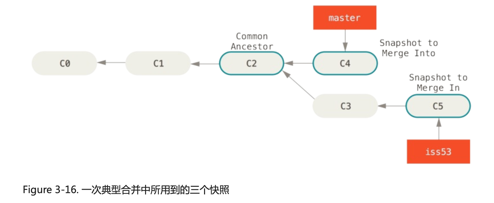
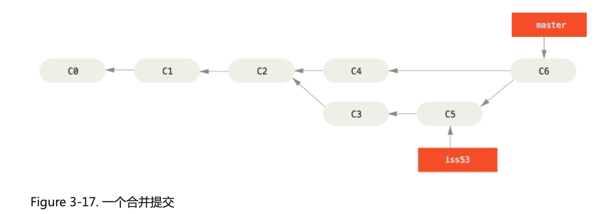

书籍名称：Pro Git 中文版

一本介绍 Git 的小书，看看写了些什么。

---

## 目录

- [起步](#起步)
- [Git 基础](#git-基础)
- [Git 分支](#git-分支)

---

## 起步

本地版本控制系统（简单数据库记录文件各次变动差异）-> 集中化的版本控制系统（CVCS）-> 分布式版本控制系统（D VCS）

分布式体现在不仅仅是将最新的文件下载下来，而是整个仓库的镜像，可以理解成集中式只是一些最新的文件，而分布式是一个“本地版本控制系统”，可以用这个恢复远端数据库。

Git 是 Linux 社区开发的产物（ps.伟大的开源！伟大的 Linux！）。

其他分布式管理系统保存一组基本文件和每个文件随着时间逐步积累的差异：


Git 将数据看成小型文件系统的一组快照：


Git 的工作区、暂存区和 Git 仓库：


---

## Git 基础

工作目录下的文件只有可能是两种状态其中之一：已跟踪或者未跟踪。

已跟踪文件表示被纳入版本控制的文件，可能处于：未修改、已修改、已放入暂存区。


### 忽略文件

文件 .gitignore 的格式规范如下：

- #开头的行表示注释
- 使用标准的 glob 模式匹配
- 匹配模式可以以 / 开头防止递归
- 匹配模式可以以 / 结尾指定目录
- ！取反

```
# no .a files
*.a

# but do track lib.a, even though you're ignoring .a files above
!lib.a

# only ignore the TODO file in the current directory, not subdir/TODO
/TODO

# ignore all files in the build/ directory
build/

# ignore doc/notes.txt, but not doc/server/arch.txt
doc/*.txt

# ignore all .pdf files in the doc/ directory
doc/**/*.pdf
```

---

## Git 分支

Git 使用 blob 对象来保存文件快照，当首次提交时，存在一个包含提交信息的 commit 对象、对应文件索引的 tree 对象，还有对应文件快照的 blob 对象：


修改内容后再次提交，本次提交对象将会包含一个指向上次提交对象（父对象）的指针。


git branch 创建一个新的，可以移动的指针：


git checkout 切换 HEAD 指向的分支：


在执行 merge 时，如果当前分支是被合并分支的祖先分支，那么执行的操作就仅仅是将指针向右移动：

|  |  |
| ------------------------------------------------------------ | ------------------------------------------------------------ |

当需要合并两个并非以上情况的分支时，需要做一次三方合并：

|  |  |
| ------------------------------------------------------------ | ------------------------------------------------------------ |

