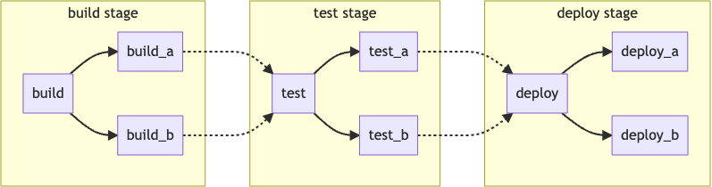
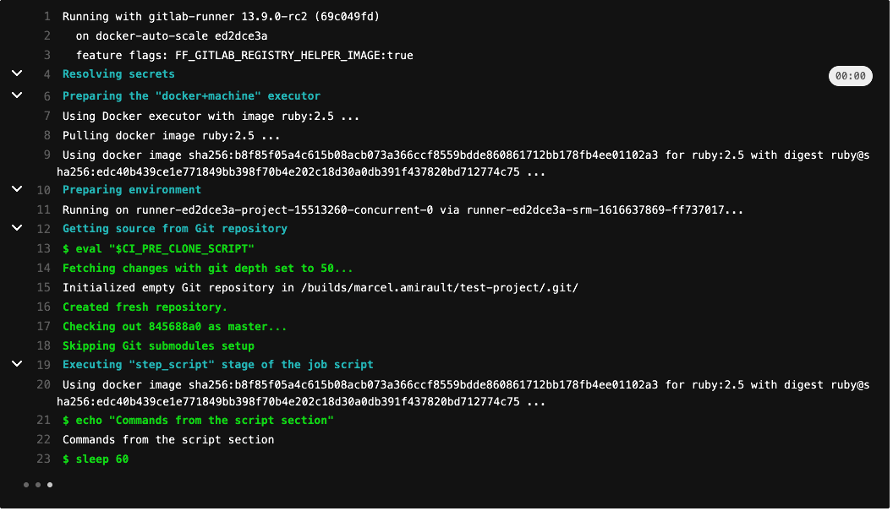

### [GitLab Runner](https://zhuanlan.zhihu.com/p/59538397)

这篇文章介绍 GitLab Runner 实际上就是一个 docker container，由 GitLab Runner 来自动创建，运行的环境由 GitLab Runner 程序控制，使用 docker 来建立 runner，使得每一个虚拟环境都干净，轻量，相互隔离，互不影响。

GitLab-Runner 执行情况如下：


---

[CI/CD](https://docs.gitlab.com/ee/ci/introduction/#continuous-delivery)

### CI( Continuous Integration )

> Each change submitted to an application, even to development branches, is built and tested automatically and continuously. These tests ensure the changes pass all tests, guidelines, and code compliance standards you established for your application.

持续融合的内涵就是持续的提交代码，每次增量式的代码都去跑一遍构建和测试阶段。

### Continuous Delivery

持续交付就是不需要人为干预，在大公司比较适合开发完成后验收通过后维护时，修修小 bug 什么就不太需要产品走查测试验收什么的。否则的话一开始开发就“持续交付”，不太合适成熟公司的成熟产品交付。

如果从一开始就采用持续交付的话，比较适合小团队或个人开发者的“探索型“项目。

### CD( Continous Deployment )

持续部署是指开发，提交之后自动部署，不需要人为干预了。

---

### GitLab CI/CD 流程

简略版本：


详细版本：


---

### CI/CD 流水线( pipeline )

流水线( pipeline )是 CI/CD 的上层组件，由两个部分组成：

1. 任务( jobs )：定义要做什么，例如编译或者测试代码。
2. 阶段( stages )：定义什么时候运行任务，例如测试阶段的执行在编译阶段之后。

如果前一个阶段的任务执行成功，那么就会执行下一个阶段的任务；如果一个阶段的任务执行失败，一般而言下一个阶段的任务不会被执行，同时流水线会提前结束。

一般而言，流水线在创建后就会自动执行，不需要人为插入，当然也有手动介入流水线的机会。

一般一个典型的流水线由四个阶段组成：

1. 编译阶段
2. 测试阶段
3. 交付准备( staging )阶段
4. 生产( production )阶段

### 流水线结构

有三种主要的流水线结构：

1. 基础( Basic )
2. [Directed Acyclic Graph](https://docs.gitlab.com/ee/ci/pipelines/pipeline_architectures.html#directed-acyclic-graph-pipelines)
3. [Child/Parent Pipelines](https://docs.gitlab.com/ee/ci/pipelines/pipeline_architectures.html#child--parent-pipelines)

下图就是一个基础流水线的示意图和对应的 .gitlab-ci.yml 文件内容：



```yaml
stages:
  - build
  - test
  - deploy

image: alpine

build_a:
  stage: build
  script:
    - echo "This job builds something."

build_b:
  stage: build
  script:
    - echo "This job builds something else."

test_a:
  stage: test
  script:
    - echo "This job tests something. It will only run when all jobs in the"
    - echo "build stage are complete."

test_b:
  stage: test
  script:
    - echo "This job tests something else. It will only run when all jobs in the"
    - echo "build stage are complete too. It will start at about the same time as test_a."

deploy_a:
  stage: deploy
  script:
    - echo "This job deploys something. It will only run when all jobs in the"
    - echo "test stage complete."

deploy_b:
  stage: deploy
  script:
    - echo "This job deploys something else. It will only run when all jobs in the"
    - echo "test stage complete. It will start at about the same time as deploy_a."
```

---

### CI/CD 任务( jobs )

任务( jobs )是 .gitlab-ci.yml 文件最基础的组成元素，任务需要：

1. 定义它们在什么样的条件下被执行
2. 顶层包含一个名称，内容至少包含一个 script 块
3. 没有被定义的数量限制

例如：

```yaml
job1:
  script: "execute-script-for-job1"

job2:
  script: "execute-script-for-job2"
```

### 选择任务执行的时机

为了配置一个任务包含或者不包含在一个确定的流水线内，可以用以下关键词：

- rules
- only
- except

rules 将会从上到下依次去计算，直到首次匹配为止，下面是一个使用 rules 关键词的例子：

```yaml
job:
  script: echo "Hello, Rules!"
  rules:
    - if: '$CI_PIPELINE_SOURCE == "merge_request_event"'
      when: manual
      allow_failure: true
    - if: '$CI_PIPELINE_SOURCE == "schedule"'
```

如果是一个合并请求的流水线，那么首条规则被匹配，该任务将会被添加到合并请求的流水线当中：

- when:manual (手动任务)
- allow_failure: true (即使手动任务没有被运行，流水线继续执行)

如果流水线不是合并请求产生的，那么第一条规则就没有被匹配，第二条规则会被计算。

如果流水线是一个计划流水线( scheduled pipeline )，第二条规则被匹配，任务被添加到计划流水线当中，没有定义属性( attributes )，它会选择默认值添加：

- when: on_success ( default )
- allow_failure: false ( default )

在其他情况下，没有规则被匹配，任务不会被添加到其他流水线当中。

或者我们也可以将一些任务选择在某些流水线不执行，而在其他流水线执行：

```yaml
job:
  script: echo "Hello, Rules!"
  rules:
    - if: '$CI_PIPELINE_SOURCE == "merge_request_event"'
      when: never
    - if: '$CI_PIPELINE_SOURCE == "schedule"'
      when: never
    - when: on_success
```

only 和 except 的写法和 rules 有点不一样，但是逻辑基本是一样的：

```yaml
docker build service one:
  script: docker build -t my-service-one-image:$CI_COMMIT_REF_SLUG .
  only:
    refs:
      - merge_requests
    changes:
      - Dockerfile
      - service-one/**/*
```

该任务仅仅会被添加到合并请求的流水线上，在 Dockerfile 或 service-one 指定目录下的文件被修改时才会执行。

下面是一个 except 的例子：

```yaml
test:
  script: npm run test
  except:
    refs:
      - main
    changes:
      - "README.md"
```

当下面任意一个条件满足时，测试任务不会被触发：

- 流水线运行在 main 分支上
- 仓库中根文件夹下的 README.md 文件被修改

---

### 自定义 CI/CD 变量

你可以通过以下方式来创建自定义的 CI / CD 变量：

- 在一个项目中：
  - 在项目的 .gitlab-ci.yml 文件上
  - 在项目设置中
  - 通过 API 调用
- 对于一个组( group )的所有项目( projects )，在组的设置中
- 对于在一个 GitLab 实例中的所有项目，在实例的设置中

可以在文件中定义所有任务都能使用的变量，也可以给每个任务定义自己的变量：

```yaml
variables:
  TEST_VAR: "All jobs can use this variable's value"

job1:
  variables:
    TEST_VAR_JOB: "Only job1 can use this variable's value"
  script:
    - echo "$TEST_VAR" and "$TEST_VAR_JOB"
```

可以在变量中引用变量：

```yaml
job:
  variables:
    FLAGS: '-al'
    LS_CMD: 'ls "$FLAGS"'
  script:
    - 'eval "$LS_CMD"'  # Executes 'ls -al'
```

也可以使用“$$”转义字符“$":

```yaml
job:
  variables:
    FLAGS: '-al'
    LS_CMD: 'ls "$FLAGS" $$TMP_DIR'
  script:
    - 'eval "$LS_CMD"'  # Executes 'ls -al $TMP_DIR'
```

### 预定义变量

GitLab 包含一些预定义变量，能够在每一个 GitLab CI/CD 流水线中使用：

[预定义变量引用](https://docs.gitlab.com/ee/ci/variables/predefined_variables.html)

---

### .gitlab-ci.yml 文件

使用 GitLab 的 CI/CD 需要：

1. Git 仓库中的应用代码
2. 一个在仓库根目录下名为 .gitlab-ci.yml 的文件，包含 CI/CD 的设置项

在 .gitlab-ci.yml 文件中，可以定义：

1. 希望运行的脚本
2. 你希望包含的其他配置文件或者模版
3. 依赖和缓存
4. 希望串行或并行执行的命令
5. 部署应用的位置
6. 脚本什么时候执行，什么时候手动触发

脚本( script )是任务( jobs )的分组，作为流水线的一部分运行。你可以将不同的独立任务按照阶段分组，并让它们按照指定的顺序执行。CI/CD 需要至少一个未被隐藏的任务。

一个典型的 .gitlab-ci.yml 文件如下所示：

```yaml
stages:
  - build
  - test

build-code-job:
  stage: build
  script:
    - echo "Check the ruby version, then build some Ruby project files:"
    - ruby -v
    - rake

test-code-job1:
  stage: test
  script:
    - echo "If the files are built successfully, test some files with one command:"
    - rake test1

test-code-job2:
  stage: test
  script:
    - echo "If the files are built successfully, test other files with a different command:"
    - rake test2
```

在这个例子中，build-code-job 任务在编译( build )阶段执行，它输出使用的 Ruby 版本，然后运行 rake 来编译项目文件，如果这个任务最后成功了。在 test 阶段的两个 test-code-job 任务将会并行执行。

例子中的整个流水线由三个任务组成，被划分在两个阶段中: build 和 test。在项目中任何分支的改变被 push 上去都会导致流水线重新运行。

流水线不仅向你展示运行结果，同时你通过控制台也能看到执行过程：



[.gitlab-ci.yml 文件关键字](https://docs.gitlab.com/ee/ci/yaml/)

### 配置复用

有三种可以将 .gitlab-ci.yml 文件中的配置复用：

1. 使用锚定( anchors )语法
2. 使用 extend 关键字
3. 使用 !reference 标签

下面是分别在三种情况下的语法。

anchors 语法：

```yaml
.job_template: &job_configuration  # Hidden yaml configuration that defines an anchor named 'job_configuration'
  image: ruby:2.6
  services:
    - postgres
    - redis

test1:
  <<: *job_configuration           # Merge the contents of the 'job_configuration' alias
  script:
    - test1 project

test2:
  <<: *job_configuration           # Merge the contents of the 'job_configuration' alias
  script:
    - test2 project
```

extends 关键字:

```yaml
.tests:
  rules:
    - if: $CI_PIPELINE_SOURCE == "push"

.rspec:
  extends: .tests
  script: rake rspec

rspec 1:
  variables:
    RSPEC_SUITE: '1'
  extends: .rspec

rspec 2:
  variables:
    RSPEC_SUITE: '2'
  extends: .rspec

spinach:
  extends: .tests
  script: rake spinach
```

!reference 标签：

```yaml
.vars:
  variables:
    URL: "http://my-url.internal"
    IMPORTANT_VAR: "the details"

test-vars-1:
  variables: !reference [.vars, variables]
  script:
    - printenv

test-vars-2:
  variables:
    MY_VAR: !reference [.vars, variables, IMPORTANT_VAR]
  script:
    - printenv
```

更详细的内容可以参见：[Optimize GitLab CI/CD configuration files](https://docs.gitlab.com/ee/ci/yaml/yaml_optimization.html)
