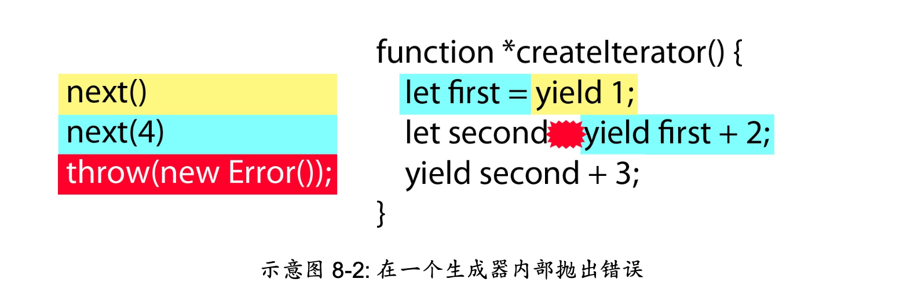

## 目录

- [块级绑定](#块级绑定)
- [字符串与正则表达式](#字符串与正则表达式)
- [函数](#函数)
- [扩展的对象功能](#扩展的对象功能)
- [解构](#解构)
- [符号与符号属性](#符号与符号属性)
- [Set与Map](#set与map)
- [迭代器和生成器](#迭代器和生成器)
- [Promise 与异步编程](#promise-与异步编程)

---

## 块级绑定

使用 let 或 const 声明的变量，在达到声明处之前都是无法访问的，试图访问会导致一个引用错误，即使在通常是安全的操作时(例如使用 typeof 运算符)，也是如此。

在使用 var 的情况下利用立即调用函数表达式 （IIFEs）来实现“块级作用域”的模拟实现：

```javascript
var funcs = [];
for (var i = 0; i < 10; i++) {
    funcs.push((function(value) {
        return function() {
            console.log(value);
        } 
    }(i)));
}
funcs.forEach(function(func) { 
  func(); // 从 0 到 9 依次输出
});
```

在常规的 for 循环当中，循环会在试图修改变量值的时候抛出错误：

```javascript
var funcs = [];
// 在一次迭代后抛出错误
for (const i = 0; i < 10; i++) {
    funcs.push(function() {
        console.log(i);
    }); 
}
```

但是在 for-in 和 for-of 循环中可以安全地使用 const 。

```javascript
var funcs = [],
    object = {
        a: true,
        b: true,
        c: true
    };

// 不会导致错误
for (const key in object) {
    funcs.push(function() {
        console.log(key);
    }); 
}

funcs.forEach(function(func) {
    func(); // 依次输出 "a"、 "b"、 "c"
});
```

当在全局作用域上使用 var 时，它会创建一个新的全局变量，并成为全局对象(在浏览器中是 window )的一 个属性。这意味着使用 var 可能会无意覆盖一个已有的全局属性，然而若你在全局作用域上使用 let 或 const ，虽然在全局作用域上会创建新的绑定，但不会有任何属性被添加到全局对象上。

块级绑定的最佳实践是，在默认情况下使用 const，在知道变量需要更改的情况下使用 let。

---

## 字符串与正则表达式

在 ES6 之前， JS 的字符串以 16 位字符编码（UCS-2）为基础，每一个16位序列都是一个码元（code unit），用于表示一个字符。

Unicode 规定的全球唯一标识符称为代码点（code points），是从 0 开始的简单数字。

```javascript
var text = "𠮷";

console.log(text.length);           // 2
console.log(/^.$/.test(text));      // false
console.log(text.charAt(0));        // ""
console.log(text.charAt(1));        // ""
console.log(text.charCodeAt(0));    // 55362
console.log(text.charCodeAt(1));    // 57271
```

在 UTF-16 使用单个 16 位码元的范围称为多语言基本平面（BMP），超出该范围的代码点不能用单个 16 位码元表示，而是会落在扩展平面内，UFT-16 引入代理对来解决这个问题，允许用两个 16 位码元来代表单个代码点。

在 ES6 中，为全面支持 UTF-16 新增方法是 codePointAt( ) ，它可以在给定字符串中按位置提取 Unicode 代码点：

```javascript
var text = "𠮷a";

console.log(text.charCodeAt(0));    // 55362
console.log(text.charCodeAt(1));    // 57271
console.log(text.charCodeAt(2));    // 97

console.log(text.codePointAt(0));   // 134071
console.log(text.codePointAt(1));   // 57271
console.log(text.codePointAt(2));   // 97
```

也可以根据该方法判断字符占一个码元还是两个码元：

```javascript
function is32Bit(c) {
    return c.codePointAt(0) > 0xFFFF;
}

console.log(is32Bit("𠮷"));         // true
console.log(is32Bit("a"));          // false
```

ES6 还提供了一个方法 fromCodePoint 从码元返回字符：

```javascript
console.log(String.fromCodePoint(134071));  //
```

### 正则表达式 u 标志

当一个正则表达式设置了 u 标志时，它的工作模式从针对码元转换为针对字符：

```javascript
var text = "𠮷";

console.log(text.length);           // 2
console.log(/^.$/.test(text));      // false
console.log(/^.$/u.test(text));     // tr
```

在不兼容 ES6 的 JS 引擎中使用 /u 会导致错误，所以可以通过一个函数验证是否支持 /u 写法：

```javascript
function hasRegExpU() {
    try {
        var pattern = new RegExp(".", "u");
        return true;
    } catch (ex) {
        return false;
    }
}
```

### 字符串的其他改动

includes( ) 方法，在给定文本存在于字符串中的任意位置时会返回 true ，否则返回 false 。

startsWith( ) 方法，在给定文本出现在字符串起始处时返回 true ，否则返回 false 。

endsWith( ) 方法，在给定文本出现在字符串结尾处时返回 true ，否则返回 false 。

repeat( ) 方法，它接受一个参数作为字符串的重复次数，返回一个将初始字符串重复指定次数的新字符串。

### 正则表达式的其他改动

```javascript
var text = "hello1 hello2 hello3",
    pattern = /hello\d\s?/,
    result = pattern.exec(text),
    globalPattern = /hello\d\s?/g,
    globalResult = globalPattern.exec(text),
    stickyPattern = /hello\d\s?/y,
    // sticky 加上之后如果首字符不匹配那就跪了，底下改 lastIndex 就属于跪了
    stickyResult = stickyPattern.exec(text);

console.log(result[0]);         // "hello1 "
console.log(globalResult[0]);   // "hello1 "
console.log(stickyResult[0]);   // "hello1 "

pattern.lastIndex = 1;
globalPattern.lastIndex = 1;
stickyPattern.lastIndex = 1;

result = pattern.exec(text);
globalResult = globalPattern.exec(text);
stickyResult = stickyPattern.exec(text);

console.log(result[0]);         // "hello1 "
console.log(globalResult[0]);   // "hello2 "
console.log(stickyResult[0]);   // Error! stickyResult is null
```

```javascript
var text = "hello1 hello2 hello3",
    pattern = /hello\d\s?/,
    result = pattern.exec(text),
    globalPattern = /hello\d\s?/g,
    globalResult = globalPattern.exec(text),
    stickyPattern = /hello\d\s?/y,
    stickyResult = stickyPattern.exec(text);

console.log(result[0]);         // "hello1 "
console.log(globalResult[0]);   // "hello1 "
console.log(stickyResult[0]);   // "hello1 "

console.log(pattern.lastIndex);         // 0
console.log(globalPattern.lastIndex);   // 7
console.log(stickyPattern.lastIndex);   // 7

result = pattern.exec(text);
globalResult = globalPattern.exec(text);
stickyResult = stickyPattern.exec(text);

console.log(result[0]);         // "hello1 "
console.log(globalResult[0]);   // "hello2 "
console.log(stickyResult[0]);   // "hello2 "

console.log(pattern.lastIndex);         // 0
console.log(globalPattern.lastIndex);   // 14
console.log(stickyPattern.lastIndex);   // 14
```

只有调用正则表达式对象上的方法(例如 exec( ) 与 test( ) 方法)， lastIndex 属性才会生效。而将正则表达式作为参数传递给字符串上的方法(例如 match( ) )，并不会体现粘连特性。

ES6 增加了复制正则表达式的方法：

```javascript
var re1 = /ab/i,

    // throws an error in ES5, okay in ES6
    re2 = new RegExp(re1, "g");
```

ES6 增加了 flag 属性：

```javascript
var re = /ab/g;

console.log(re.source);     // "ab"
console.log(re.flags);      // "g"
```

### 模版字面量

使用模版字面量时缩进的影响非常大：

```javascript
let message = `Multiline
               string`;

console.log(message);           // "Multiline
                                //                 string"
console.log(message.length);    // 31
```

可以采用一种巧妙的方式:

```javascript
let html = `
<div>
    <h1>Title</h1>
</div>`.trim();
```

模版字面量的替换位由起始的 ${ 与结束的 } 来界定，其中允许放入任意的 JS 表达式。

模版字面量本身也是 JS 表达式，可以将模版表达式嵌套在模版表达式当中。

---

## 函数

使用 ES6 的默认参数时，只有当对应位置传入 undefined 时候才会采用默认参数：

```javascript
// uses default timeout
makeRequest("/foo", undefined, function(body) {
    doSomething(body);
});

// uses default timeout
makeRequest("/foo");

// doesn't use default timeout
makeRequest("/foo", null, function(body) {
    doSomething(body);
});
```

ES 6 下 arguments 严格反映传入参数的情况：

```javascript
// not in strict mode
function mixArgs(first, second = "b") {
    console.log(arguments.length); // 1
    console.log(first === arguments[0]); // true
    console.log(second === arguments[1]); // false
    first = "c";
    second = "d"
    console.log(first === arguments[0]); // false
    console.log(second === arguments[1]); // false
}

mixArgs("a");
```

在设定默认参数时，可以选择函数调用来替换字面量，也可以用之前的参数作为这个函数调用的默认参数：

```javascript
function getValue(value) {
    return value + 5;
}

function add(first, second = getValue(first)) {
    return first + second;
}

console.log(add(1, 1));     // 2
console.log(add(1));        // 7
```

### 剩余参数

剩余参数收到两点限制：首先是函数只能有一个剩余参数，并且它必须放到最后；第二个限制是剩余参数不能在对象字面量的 setter 属性中使用。

### 函数构造器的增强能力

Function 构造器允许根据字符串动态的创建新函数：

```javascript
var add = new Function("first", "second = first",
        "return first + second");

console.log(add(1, 1));     // 2
console.log(add(1));        // 2
```

```javascript
var pickFirst = new Function("...args", "return args[0]");

console.log(pickFirst(1, 2));   // 1
```

### 箭头函数

箭头函数没有 this、super、arguments，也没有 new.target 绑定；不能被 new 调用；没有原型。

可以利用箭头函数创建立即调用函数表达式（IIFE）：

```javascript
let person = function(name) {

    return {
        getName: function() {
            return name;
        }
    };

}("Nicholas");

console.log(person.getName());      // "Nicholas"
```

### 尾调用优化

尾调用（tail call）指的是调用函数的语句是另一个函数的最后语句：

```javascript
function doSomething() {
    return doSomethingElse();   // tail call
}
```

当满足以下条件时，尾调用优化清除当前栈帧并再次利用，而不是为尾调用创建新的栈帧：

1. 尾调用不能引用当前栈帧中的变量（函数不是闭包）
2. 在尾调用返回结果后不能进行额外操作
3. 尾调用结果为当前函数返回值

以下代码为返回后进行额外操作的例子：

```javascript
"use strict";

function doSomething() {
    // not optimized - must add after returning
    return 1 + doSomethingElse();
}
```

---

## 拓展的对象功能

### 方法简写

ES6 给出了对象的方法简写：

```javascript
var person = {
    name: "Nicholas",
    sayName() {
        console.log(this.name);
    }
};
```

 ### 使用 super 引用的简单原型访问

当覆盖对象实例的一个方法，同时要调用原型上的一个同名方法，在 ES5 的代码可能是这样的：

```javascript
let person = {
    getGreeting() {
        return "Hello";
    }
};


let friend = {
    getGreeting() {
        return Object.getPrototypeOf(this).getGreeting.call(this) + ", hi!";
    }
};

// set prototype to person
Object.setPrototypeOf(friend, person);
console.log(friend.getGreeting());                      // "Hello, hi!"
console.log(Object.getPrototypeOf(friend) === person);  // true
```

但是在 ES6 上可以使用 super 来调用：

```javascript
let friend = {
    getGreeting() {
        // in the previous example, this is the same as:
        // Object.getPrototypeOf(this).getGreeting.call(this)
        return super.getGreeting() + ", hi!";
    }
};
```

但是注意这个引用必须位于 ES6 简写方法之内。

---

## 解构

### 对象解构

当在声明变量的时候选择解构赋值不需要将语句放在括号内，但必须保证赋值的右边内容存在：

```javascript
let node = {
        type: "Identifier",
        name: "foo"
    };

let { type, name } = node;

console.log(type);      // "Identifier"
console.log(name);      // "foo"
```

当不在声明处使用解构赋值时，需要使用括号括起来（告诉编译器不是代码块的花括号）：

```javascript
let node = {
        type: "Identifier",
        name: "foo"
    },
    type = "Literal",
    name = 5;

// assign different values using destructuring
({ type, name } = node);

console.log(type);      // "Identifier"
console.log(name);      // "foo"
```

解构赋值找不到的赋值 undefined，可以给解构赋值设置默认值。

可以给对象的解构赋值赋一个不同的名字：

```javascript
let node = {
        type: "Identifier",
        name: "foo"
    };

let { type: localType, name: localName } = node;

console.log(localType);     // "Identifier"
console.log(localName);     // "foo"
```

对象解构赋值的多级嵌套写法：

```javascript
let node = {
        type: "Identifier",
        name: "foo",
        loc: {
            start: {
                line: 1,
                column: 1
            },
            end: {
                line: 1,
                column: 4
            }
        }
    };

// extract node.loc.start
let { loc: { start: localStart }} = node;

console.log(localStart.line);   // 1
console.log(localStart.column); // 1
```

### 数组解构

对象的解构与对象的属性名有关，而数组的解构与数组的位置有关：

```javascript
let colors = [ "red", "green", "blue" ];

let [ firstColor, secondColor ] = colors;

console.log(firstColor);        // "red"
console.log(secondColor);       // "green
```

```javascript
let colors = [ "red", "green", "blue" ];

let [ , , thirdColor ] = colors;

console.log(thirdColor);        // "blue"
```

数组也允许嵌套解构：

```javascript
let colors = [ "red", [ "green", "lightgreen" ], "blue" ];

// later

let [ firstColor, [ secondColor ] ] = colors;

console.log(firstColor);        // "red"
console.log(secondColor);       // "green"
```

数组解构也会支持剩余项：

```javascript
let colors = [ "red", "green", "blue" ];

let [ firstColor, ...restColors ] = colors;

console.log(firstColor);        // "red"
console.log(restColors.length); // 2
console.log(restColors[0]);     // "green"
console.log(restColors[1]);     // "blue"
```

### 混合解构

对象解构和数组解构可以混合在一起使用，就像这样：

```javascript
let node = {
        type: "Identifier",
        name: "foo",
        loc: {
            start: {
                line: 1,
                column: 1
            },
            end: {
                line: 1,
                column: 4
            }
        },
        range: [0, 3]
    };

let {
    loc: { start },
    range: [ startIndex ]
} = node;

console.log(start.line);        // 1
console.log(start.column);      // 1
console.log(startIndex);        // 0
```

### 参数解构

当参数解构没有预设默认值，又没有传入任何东西时，会有报错：

```javascript
function setCookie(name, value, { secure, path, domain, expires }) {

    // code to set the cookie
}

setCookie("type", "js");
```

可以预设一个空对象来防止报错：

```javascript
function setCookie(name, value, { secure, path, domain, expires } = {}) {

    // ...
}
```

可以为每一个都预设参数保证程序运行正确：

```javascript
function setCookie(name, value,
    {
        secure = false,
        path = "/",
        domain = "example.com",
        expires = new Date(Date.now() + 360000000)
    } = {}
) {

    // ...

```

---

## 符号与符号属性

符号（Symbol）被设计用于创建对象私有成员，在此之前，字符串作为属性名导致无论命名规则如何都能被轻易访问。

### 创建符号值

可以采用全局函数 Symbol 来创建一个符号：

```javascript
let firstName = Symbol();
let person = {};

person[firstName] = "Nicholas";
console.log(person[firstName]);     // "Nicholas"
```

Symbol 函数可以接受一个额外的参数来描述符号值，但该描述不能用于访问对应属性：

```javascript
let firstName = Symbol("first name");
let person = {};

person[firstName] = "Nicholas";

console.log("first name" in person);        // false
console.log(person[firstName]);             // "Nicholas"
console.log(firstName);                     // "Symbol(first name)"
```

### 共享符号值

创建共享符号值，应该使用 Symbol.for( ) 方法而不是 Symbol( ) 方法，该方法接受单个字符串类型的参数。

```javascript
let uid = Symbol.for("uid");
let object = {
    [uid]: "12345"
};

console.log(object[uid]);       // "12345"
console.log(uid);               // "Symbol(uid)"

let uid2 = Symbol.for("uid");

console.log(uid === uid2);      // true
console.log(object[uid2]);      // "12345"
console.log(uid2);              // "Symbol(uid)"
```

针对共享的符号值，还有一个获得对应标识的 keyFor 方法：

```javascript
let uid = Symbol.for("uid");
console.log(Symbol.keyFor(uid));    // "uid"

let uid2 = Symbol.for("uid");
console.log(Symbol.keyFor(uid2));   // "uid"

let uid3 = Symbol("uid");
console.log(Symbol.keyFor(uid3));   // undefined
```

### 检索

Object.keys( ) 和 Object.getOwnPropertyNames( ) 可以检索对象的所有属性名称，前者返回所有的可枚举属性名称，而后者返回所有属性名称而无视其是否可枚举，但两者然而两者都不能返回符号类型的属性，以保持它们在 ES5 中的功能不发生变化。而 ES6 新增了 Object.getOwnPropertySymbols( ) 方法，以便让你可以检索对象的符号类型属性。

```javascript
let uid = Symbol.for("uid");
let object = {
    [uid]: "12345"
};

let symbols = Object.getOwnPropertySymbols(object);

console.log(symbols.length);        // 1
console.log(symbols[0]);            // "Symbol(uid)"
console.log(object[symbols[0]]);    // "12345"

```

---

## Set与Map

### Set

可以使用数组来初始化 Map：

```javascript
let set = new Set([1, 2, 3, 4, 5, 5, 5, 5]);
console.log(set.size);    // 5
```

可以使用 add、has、delete、clear 方法对集合进行操作。

### forEach

Set 具有一个 forEach 方法，其中回调函数前两个参数都是 Set 中下个位置的值。

### WeakSet

1. 对于 WeakSet 的实例，若调用 add( ) 方法时传入了非对象的参数，就会抛出错误( has( ) 或 delete( ) 则会在传入了非对象的参数时返回 false );
2. Weak Set 不可迭代，因此不能被用在 for-of 循环中;
3. Weak Set 无法暴露出任何迭代器(例如 keys( ) 与 values( ) 方法)，因此没有任何编程手段可用于判断 Weak Set 的内容;
4. Weak Set 没有 forEach( ) 方法;
5. Weak Set 没有 size 属性。

---

## 迭代器和生成器

迭代器是被设计专用于迭代的对象，带有特定接口。所有的迭代器对象都拥有 next( ) 方法，会返回一个结果对象。该结果对象有两个属性:对应下一个值的 value ，以及一个布尔类型的 done ，其值为 true 时表示没有更多值可供使用。迭代器持有一个指向集合位置的内部指针，每当调用了 next( ) 方法，迭代器就会返回相应的下一个值。

```javascript
function createIterator(items) {
    var i = 0;
    return {
        next: function() {
            var done = (i >= items.length);
            var value = !done ? items[i++] : undefined;
            return {
                done: done,
                value: value
            };
        }
    };
}

var iterator = createIterator([1, 2, 3]);
console.log(iterator.next());           // "{ value: 1, done: false }"
console.log(iterator.next());           // "{ value: 2, done: false }"
console.log(iterator.next());           // "{ value: 3, done: false }"
console.log(iterator.next());           // "{ value: undefined, done: true }"
// for all further calls
console.log(iterator.next());           // "{ value: undefined, done: true }"
```

生成器( generator )是能返回一个迭代器的函数。生成器函数由放在 function 关键字之后的一个星号( * )来表示，并能使用新的 yield 关键字。将星号紧跟在 function 关键字之后，或是在中间留出空格，都是没问题的：

```javascript
// generator
function *createIterator() {
    yield 1;
    yield 2;
    yield 3;
}

// generators are called like regular functions but return an iterator
let iterator = createIterator();

console.log(iterator.next().value);     // 1
console.log(iterator.next().value);     // 2
console.log(iterator.next().value);     // 3
```

### 可迭代对象和 for-of 循环

与迭代器紧密相关的是，可迭代对象( **iterable** )是包含 Symbol.iterator 属性的对象。这个 Symbol.iterator 知名符号定义了为指定对象返回迭代器的函数。在 ES6 中，所有的集合对象(数组、 Set 与 Map )以及字符串都是可迭代对象，因此它们都被指定了默认的迭代器。可迭代对象被设计用于与 ES 新增的 for-of 循环配合使用。

开发者自定义对象默认情况下不是可迭代对象，但你可以创建一个包含生成器的 Symbol.iterator 属性，让它们成为可迭代对象。

```javascript
let collection = {
    items: [],
    *[Symbol.iterator]() {
        for (let item of this.items) {
            yield item;
        }
    }

};

collection.items.push(1);
collection.items.push(2);
collection.items.push(3);

for (let x of collection) {
    console.log(x);
}
```

ES6 具有三种集合对象类型:数组、 Map 与 Set 。这三种类型都拥有如下的迭代器，有助于探索它们的内容:

entries() :返回一个包含键值对的迭代器; values() :返回一个包含集合中的值的迭代器; keys() :返回一个包含集合中的键的迭代器。

扩展运算符能作用于所有可迭代对象，并且会使用默认迭代器来判断需要使用哪些值。所有的值都从迭代器中被读取出来并插入数组，遵循迭代器返回值的顺序。

### 传递参数给迭代器

```javascript
function *createIterator() {
    let first = yield 1;
    let second = yield first + 2;       // 4 + 2
    yield second + 3;                   // 5 + 3
}

let iterator = createIterator();

console.log(iterator.next());           // "{ value: 1, done: false }"
console.log(iterator.next(4));          // "{ value: 6, done: false }"
console.log(iterator.next(5));          // "{ value: 8, done: false }"
console.log(iterator.next());           // "{ value: undefined, done: true }"
```

### 在迭代器中抛出错误

```javascript
function *createIterator() {
    let first = yield 1;
    let second = yield first + 2;       // yield 4 + 2, then throw
    yield second + 3;                   // never is executed
}

let iterator = createIterator();

console.log(iterator.next());                   // "{ value: 1, done: false }"
console.log(iterator.next(4));                  // "{ value: 6, done: false }"
console.log(iterator.throw(new Error("Boom"))); // error thrown from generator
```



可以使用一个 try-catch 来捕获这种错误:

```javascript
function *createIterator() {
    let first = yield 1;
    let second;

    try {
        second = yield first + 2;       // yield 4 + 2, then throw
    } catch (ex) {
        second = 6;                     // on error, assign a different value
    }
    yield second + 3;
}

let iterator = createIterator();

console.log(iterator.next());                   // "{ value: 1, done: false }"
console.log(iterator.next(4));                  // "{ value: 6, done: false }"
console.log(iterator.throw(new Error("Boom"))); // "{ value: 9, done: false }"
console.log(iterator.next());                   // "{ value: undefined, done: true }"
```

### 生成器的 return 语句

```javascript
function *createIterator() {
    yield 1;
    return 42;
}

let iterator = createIterator();

console.log(iterator.next());           // "{ value: 1, done: false }"
console.log(iterator.next());           // "{ value: 42, done: true }"
console.log(iterator.next());           // "{ value: undefined, done: true }"
```

### 生成器委托

```javascript
function *createNumberIterator() {
    yield 1;
    yield 2;
    return 3;
}

function *createRepeatingIterator(count) {
    for (let i=0; i < count; i++) {
        yield "repeat";
    }
}

function *createCombinedIterator() {
    let result = yield *createNumberIterator();
    yield result;
    yield *createRepeatingIterator(result);
}

var iterator = createCombinedIterator();

console.log(iterator.next());           // "{ value: 1, done: false }"
console.log(iterator.next());           // "{ value: 2, done: false }"
console.log(iterator.next());           // "{ value: 3, done: false }"
console.log(iterator.next());           // "{ value: "repeat", done: false }"
console.log(iterator.next());           // "{ value: "repeat", done: false }"
console.log(iterator.next());           // "{ value: "repeat", done: false }"
console.log(iterator.next());           // "{ value: undefined, done: true }"
```

### 一个简单的任务运行器

由于 yield 能停止运行，并在重新开始运行前等待 next() 方法被调用，你就可以在没有回调函数的情况下实现异步调用。首先，你需要一个能够调用生成器并启动迭代器的函数，就像这样:

```javascript
function run(taskDef) {

    // create the iterator, make available elsewhere
    let task = taskDef();、
    
    // start the task
    let result = task.next();
  
    // recursive function to keep calling next()
    function step() {
        // if there's more to do
        if (!result.done) {
            result = task.next(result.value);
            step();
        }
    }
  
    // start the process
    step();
}
```

---

## Promise 与异步编程

Promises 是异步编程的另一种选择，它的工作方式类似于在其他语言中延迟并在将来执行作业。一个 Promise 指定一些稍后要执行的代码(就像事件与回调函数一样)，并且也明确标示了作业的代码是否执行成功。你能以成功处理或失败处理为基准，将 Promise 串联在一起，让代码更易理解、更易调试。

### 事件模型

```javascript
let button = document.getElementById("my-btn");
button.onclick = function(event) {
    console.log("Clicked");
};
```

在此代码中， console.log("Clicked") 直到 button 被点击后才会被执行。当 button 被点击，赋值给 onclick 的函数就被添加到作业队列的尾部，并在队列前部所有任务结束之后再执行。

### 回调模式

```javascript
readFile("example.txt", function(err, contents) {
    if (err) {
        throw err;
    }

    console.log(contents);
});
console.log("Hi!");
```

此例使用了 Node.js 惯例，即错误优先( error-first )的回调函数风格。 readFile( ) 函数用于读取磁盘中的文件(由第一个参数指定)，并在读取完毕后执行回调函数(即第二个参数)。如果存在错误，回调函数的 err 参数会是一个错误对象;否则 contents 参数就会以字符串形式包含文件内容。

使用回调函数模式， readFile( ) 会立即开始执行，并在开始读取磁盘时暂停。这意味着 console.log("Hi!") 会在 readFile( ) 被调用后立即进行输出，要早于 console.log(contents) 的打印操作。当 readFile( ) 结束操作后，它会将回调函数以及相关参数作为一个新的作业添加到作业队列的尾部。在之前的作业全部结束后，该作业才会执行。

### Promise 基础

Promise 是为异步操作结果准备的占位符，函数可以返回 Promise，不必订阅一个事件或者向函数传递一个回调函数：

```javascript
// readFile promises to complete at some point in the future
let promise = readFile("example.txt");
```

每个 Promise 都会经历一个短暂的生命周期，初始为挂起态( pending state )，这表示异步操作尚未结束。一个挂起的 Promise 也被认为是未决的( unsettled )。上个例子中的 Promise 在 readFile( ) 函数返回它的时候就是处在挂起态。一旦异步操作结束，Promise 就会被认为是已决的( settled )，并进入两种可能状态之一：
1. 已完成( fulfilled )：Promise 的异步操作已成功结束;
2. 已拒绝( rejected )：Promise 的异步操作未成功结束，可能是一个错误，或由其他原因导致。

内部的 [[PromiseState]] 属性会被设置为 "pending" 、 "fulfilled" 或 "rejected" ，以 反映 Promise 的状态。该属性并未在 Promise 对象上被暴露出来，因此你无法以编程方式判断 Promise 到底处于哪种状态。不过你可以使用 then( ) 方法在 Promise 的状态改变时执行一些特定操作。
