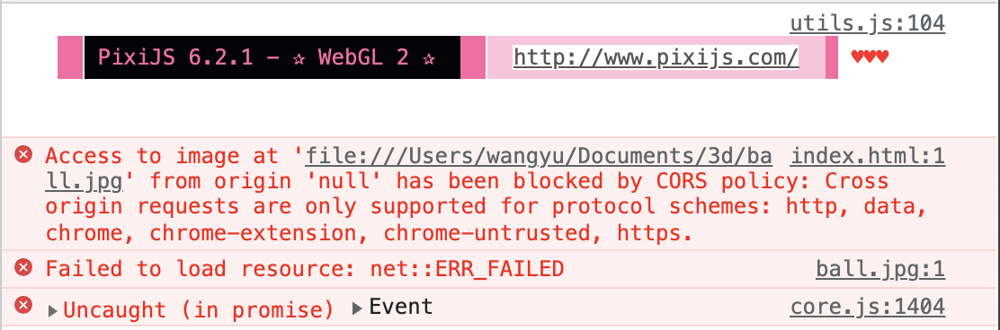
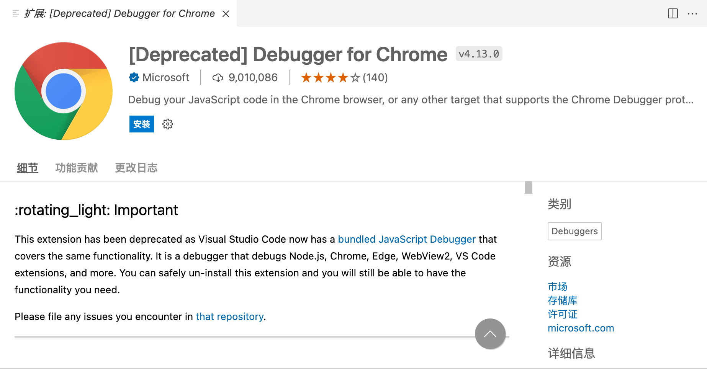
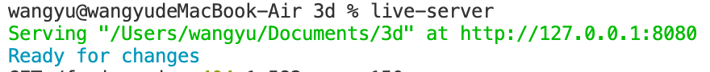

视频：

1. [3D Photo Effect from 1 Image JavaScript Tutorial](https://www.youtube.com/watch?v=FgN2EENWPFc)

参考文档：

1. [depth map - wikipedia](https://en.wikipedia.org/wiki/Depth_map)
2. [PixiJS](https://pixijs.io/guides/index.html)
3. [Create 3D Photo from Image JavaScript Tutorial](https://redstapler.co/3d-photo-from-image-javascript-tutorial/)
4. [akella/fake3d](https://github.com/akella/fake3d)
5. [VScode开启本地服务器及本地调试](https://blog.css8.cn/post/20545196.html)

---

## 目录

- [深度图](#深度图)
- [PixiJS](#pixijs)
- [一个 fake3d 的例子](#一个-fake3d-的例子)

---

## 深度图( depth map )

在计算机图形学和计算机视觉领域，**深度图（ depth map）**是描述场景物体表面到**观察点（viewpoint）**距离的工具。深度图在计算机图形学领域有很多用途，其中一个重要的用途就是提供创建立体图形的距离信息。

深度图可以由3d扫描得到或者通过多张2d图片通过算法重构得到。

---

## PixiJS

PixiJS 是一个开源的，基于 web 的图像渲染系统。底层使用了 WebGL（或者也可以选择 canvas）来显示图像和其他 2D 内容。

---

## 一个 fake3d 的例子

### 初始化

按照[视频 1](https://www.youtube.com/watch?v=FgN2EENWPFc)和[参考文档3](https://redstapler.co/3d-photo-from-image-javascript-tutorial/)的教程利用PixiJS来写一个 fake3d 的例子。

首先创建一个文件夹，在编辑器里面打开，我这里使用的是 vscode，创建一个 index.html 然后去 PixiJS 官网下载对应的文件，放在文件目录下：

[PixiJS 下载](https://github.com/pixijs/pixijs/releases)

这里需要注意 pixi.js 和 pixi.js.map 都需要下载放在目录下。

然后在 index.html 里面创建一个 HTML 模版，加载 pixi 文件。

```html
<!DOCTYPE html>
<html lang="en">
<head>
    <meta charset="UTF-8">
    <meta http-equiv="X-UA-Compatible" content="IE=edge">
    <meta name="viewport" content="width=device-width, initial-scale=1.0">
    <title>3D photos with pixiJS</title>
</head>
<body>
    <script src="./pixi.js"></script>
    <script>
      ...
    </script>
</body>
</html>
```

然后开始编写代码，首先创建一个 PIXI.Application 实例，然后将视图添加到 DOM 上：

```html
<body>
    <script src="./pixi.js"></script>
    <script>
              let app = new PIXI.Application({width:window.innerWidth,height:window.innerHeight})
        document.body.appendChild(app.view);
    </script>
</body>
```

### 添加图片

然后创建一个 Sprite 来加载一张图片，原来教程采用了一张皮卡丘的图片，但是我没有找到深度图的原图，所以使用了另一个项目（[参考文档4](https://github.com/akella/fake3d)）的图片和深度图。


```javascript
        let app = new PIXI.Application({width:window.innerWidth,height:window.innerHeight})
        document.body.appendChild(app.view);
        let img = new PIXI.Sprite.from("./ball.jpg");
        img.width = window.innerWidth;
        img.height = window.innerHeight;
        app.stage.addChild(img);
```

这时候在 Chrome 里面调试 index.html 会发现 PIXI 成功加载了但是图片没有，控制台告诉我们 Chrome 不允许我们直接这么访问本地图片。



### 开启本地服务器

按照[参考文档5](https://blog.css8.cn/post/20545196.html)的步骤来开启一个本地服务器。

首先**不要**安装Debugger for Chrome，而是改成在 vscode 插件商店里面搜索安装 JavaScript Debugger，前者已经被弃用了。



使用 npm 命令来安装本地服务器：

```bash
npm install -g live-server
```

安装完成后，在终端输入：

```bash
live-server
```



此时访问 127.0.0.1:8080 就可以看到图片成功被加载出来了。

### 添加深度图

下一步需要向 Sprite 中添加深度图：

```javascript
        depthMap = new PIXI.Sprite.from("./ball-map.jpg");
        app.stage.addChild(depthMap);

        displacementFilter = new PIXI.filters.DisplacementFilter(depthMap);
        app.stage.filters = [displacementFilter];
```

### 绑定鼠标事件

最后绑定鼠标事件即可：

```javascript
        window.onmousemove = function(e) {
            displacementFilter.scale.x = (window.innerWidth / 2 - e.clientX) /20;
            displacementFilter.scale.y = (window.innerHeight / 2 - e.clientY) /20;
        };
```

在浏览器里面晃动鼠标，实现了 fake3d 的效果。

完整代码如下：

```html
<!DOCTYPE html>
<html lang="en">
<head>
    <meta charset="UTF-8">
    <meta http-equiv="X-UA-Compatible" content="IE=edge">
    <meta name="viewport" content="width=device-width, initial-scale=1.0">
    <title>3D photos with pixiJS</title>
</head>
<body>
    <script src="./pixi.js"></script>
    <script>
        let app = new PIXI.Application({width:window.innerWidth,height:window.innerHeight})
        document.body.appendChild(app.view);
        let img = new PIXI.Sprite.from("./ball.jpg");
        img.width = window.innerWidth;
        img.height = window.innerHeight;
        app.stage.addChild(img);
        depthMap = new PIXI.Sprite.from("./ball-map.jpg");
        app.stage.addChild(depthMap);
        
        displacementFilter = new PIXI.filters.DisplacementFilter(depthMap);
        app.stage.filters = [displacementFilter];
        
        window.onmousemove = function(e) {
            displacementFilter.scale.x = (window.innerWidth / 2 - e.clientX) /20;
            displacementFilter.scale.y = (window.innerHeight / 2 - e.clientY) /20;
        };
    </script>
</body>
</html>
```

### 关于深度图的生成

深度图的生成就我目前所知道的至少有三种方法：

1. 使用 3d 扫描获得
2. 通过多张 2d 图片通过算法计算生成
3. 手动用画图工具生成

教程里面采用了第三种方法，首先用黑色覆盖在原始图像上，然后用白色的20%透明的的画笔涂抹，离屏幕越近的地方就需要越白，最后就得到了一张深度图。

