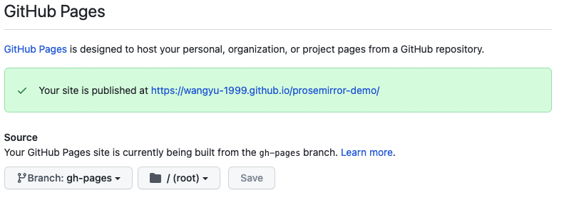
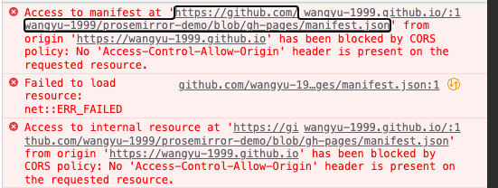
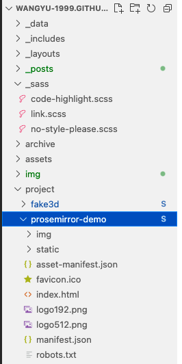
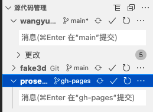
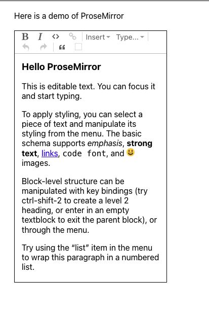

想把仓库里面的一些 demo 生成的静态页面挂在博客上，又不想因为这个花钱租服务器

来部署，就利用 GitHub Page 来解决这个问题。

## gh-pages

首先半自动的打包上传可以利用 gh-pages 这个工具，具体的操作步骤可以参考这个博客：

[github 的 gh-pages 分支展示项目页面](https://segmentfault.com/a/1190000017084155)

我的过程和他的过程有几点不太一样：

- 我用的是 pnpm ，没有用 yarn ，但效果是一样的
- 我的是 React 项目，需要在 .env.production 文件下面修改 PUBLIC_URL 的位置

其他基本都是一样的，完成后运行 pnpm run deploy 就会发现在仓库多了一个 gh-pages 的分支。

在 Github 中打开对应仓库查看 Settings > Pages 也能发现设置好了，没有的话可以手动设置一下：

---

## submodule

但是访问后发现内容并没有按照预期显示，发现页面上有一个跨域问题：

原来页面引用的资源在 github.com 的下面，而页面在 wangyu-1999.github.io 的下面，发生了跨域的问题，经过测试页面只能放在 xx.github.io 这样的地址下，所以下一步就是将打包的产物挪到页面一样的地址下。

手动的把文件全部拷贝过去当然是可行的，但是我想起小米笔记在用的 submodule 恰好也可以用来解决这个问题。

关于 submodule 的说明可以查看官方文档:

[submodule 的说明](https://git-scm.com/book/en/v2/Git-Tools-Submodules)

在这个问题中需要在*博客的项目*中新建一个文件夹，然后创建一个*目标项目*的 submodule，然后在*博客项目*中切换到*目标项目*的 gh-pages 分支，最后将博客更新 push 上去的时候就可以完成部署了。

需要注意的是需要部署前要检查  .env.production 下的 PUBLIC_URL 地址对不对，可以使用相对地址来引用。

最后可以发现之前的跨域问题没有了，表明部署已经成功了：

[ProseMirror-demo](https://wangyu-1999.github.io/prosemirror-demo/)

