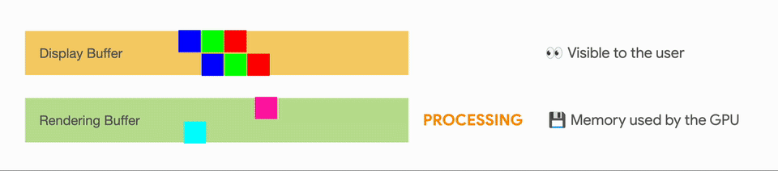

触控笔低延迟

原文链接：[Stylus Low Latency](https://medium.com/androiddevelopers/stylus-low-latency-d4a140a9c982)

# 介绍

本文主要介绍安卓团队在触控笔低延迟方面所做的一些最新工作，主要是“低延迟图形库”（ [low latency graphics ](https://developer.android.com/jetpack/androidx/releases/graphics)）和“移动轨迹预测库”（ [motion prediction](https://developer.android.com/jetpack/androidx/releases/input) ）

低延迟图形旨在降低触控笔输入到屏幕渲染的时间间隔，移动轨迹预测旨在使用算法预测触控笔下一步的轨迹。

使用这些库可以降低光标、手指、触控笔、电容笔和鼠标在屏幕书写的延迟。

下图中靠上的是使用新库的结果，靠下的是不使用新库的结果：

*测试设备：Samsung Galaxy Tab S7 + S-Pen*

# 低延迟图形

### 传统渲染过程

传统的渲染过程是一个多缓存（ multiple buffers ) 的过程，缓存的存在是为了使得使用者的体验更佳，不会出现闪烁的情况。**但是代价就是在使用者的行动与内容在屏幕可见的过程中增加了缓存，因而增加了延迟。**

*一个展示 muti-buffer rendering 的动画*

### 预缓冲渲染（ front buffer rendering ）

渲染的过程可以大致分为两个阶段：预缓冲渲染（ fronted buffer rendering ）和二次缓冲渲染（ double buffer rendering ）阶段。

在预缓冲阶段中，会以较快速度渲染整个屏幕的一小部分，产生一个临时缓存，然后会将这个结果迅速的作为输入传入二次渲染的过程中，最终生成一个持久的缓存。

*预缓冲渲染和二次缓冲渲染图示*

“低延迟图形库”使用的技术原理就是在渲染过程中，直接使用预缓冲渲染过程的结果作为最终渲染的结果。

预缓冲渲染技术适合一些特殊的场景：例如手写、绘画和草图场景，在这些场景中，每个行为只修改了屏幕的一小部分

这项技术不适用于需要渲染整个屏幕的场景，例如游戏。或者当大范围的区域被修改时，例如平移和缩放。

### 相关

[Adding Stylus support to your Android app](https://www.youtube.com/watch?v=F8boaQsioH8)

[低延迟图形官方文档](https://developer.android.com/reference/androidx/graphics/lowlatency/package-summary)

# 移动轨迹预测

移动轨迹预测，目的就是在渲染前利用卡尔曼滤波来提前报点，减少额外时间，提升用户体验。

在触控笔移动轨迹预测的卡尔曼滤波中，需要方向、速度、压力和时间作为参量。在安卓实现的“移动轨迹预测库”中，将从 MotionEvent 对象中获得坐标、压力、时间等信息，并将被用于预测下一个 MotionEvent。

在这个过程中，屏幕触控的采样率至关重要，屏幕触控的采样率在不同的设备上会有所不同。

# 结论

全文介绍了两种改善触控笔体验和降低延迟的方法，“低延迟图形库”能够使得渲染速度更快，“移动轨迹预测”可以较渲染引擎提前一步预测下一个 MotionEvent。目前这两个库都已经发布 alpha 测试版本供开发者测试和使用。

